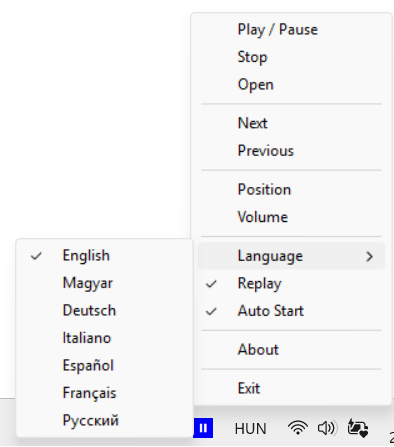

# TrayMp3



TrayMp3 is a lightweight MP3 player for Windows that resides in the system tray. It allows users to play, pause, stop, and navigate through MP3 files with simple tray menu controls. The application supports multiple languages and provides quick access to basic playback functions directly from the tray icon.

[By me a coffee](https://buymeacoffee.com/lutischanf)

# Downloads
- [Github releases](https://github.com/lutischan-ferenc/tray-mp3/releases)
- [Majorgeeks](https://www.majorgeeks.com/files/details/traymp3.html)

## Features
- Play, pause, stop, next, and previous track controls
- System tray integration for easy access
- Multi-language support
- Simple and minimalistic interface

## How to Use
1. **Launch TrayMp3.exe**: Double-click the executable to start the program. A tray icon will appear in the Windows system tray.
2. ** Icon Interaction**: 
   - When play icon and empty selection (stoped) - Left-click the tray icon to open MP3 files or to play.
   
     
   - When play icon (paused) - Left-click the tray icon to play.
   
     
   - When pause icon (playing) - Left-click the tray icon to pause.
   
     
   - Right-click the tray icon to open the menu.
   
     
   - Tooltip will show the current track name and remaing time.
   
   - 
   - The icon will change based on playback status (play icon when stoped / paused, pause icon when playing).
3. **Playback Controls**: Right-click the tray icon to open the context menu. Use the menu to:
   - Play or pause the current track
   - Stop playback
   - Skip to the next or previous track
   - Change the application language
   - Replay
   - Auto Start at Windows Startup
3. **About and Support**: The menu also provides options to view information about the program and visit the support website.
4. **Exit**: Select the 'Exit' option from the tray menu to close the application.

## How to Build
1. **Requirements**:
   - Windows OS
   - MinGW or a compatible C compiler
   - Resource compiler (for .rc files)

2. **Build Steps**:
   - Open a command prompt in the project directory.
   - Run the provided batch minmp3e:
     ```
     compile.bat
     )```
   - This will compile `TrayMp3.c` and link the resources to produce `TrayMp3.exe`.

## Depends on

[minimp3](https://github.com/lieff/minimp3)

## License
This project is licensed under the MIT License. See the LICENSE file for details.

---
For more information, visit the project's website or check the source code for details.
